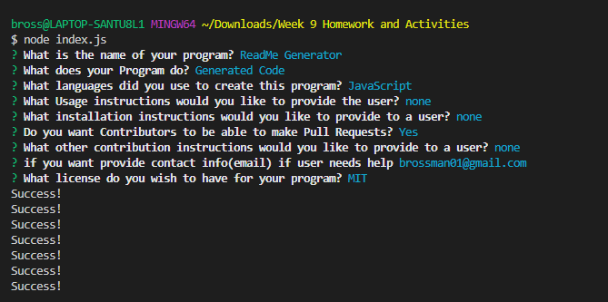

# README_Generator
This server side command line program generates a README file based on user input. I tried to capture audio and video of the program working but my laptop audio
stopped working and no amount of troubleshooting such as asking a BCS tutor for help and reinstalling screencastify or using screencast-o-matic(different app)
would work so i have a video only run through of the app.

# Usage
Using node.js it acts simple questions and then creates a file.

# License
This program is licensed under open source

repository https://github.com/Robert100-Case/README_Generator

link to video run through of app
https://drive.google.com/file/d/1uxQnb-cM_r95pAiFUhItCSoGnWitUylK/view

Screenshots

